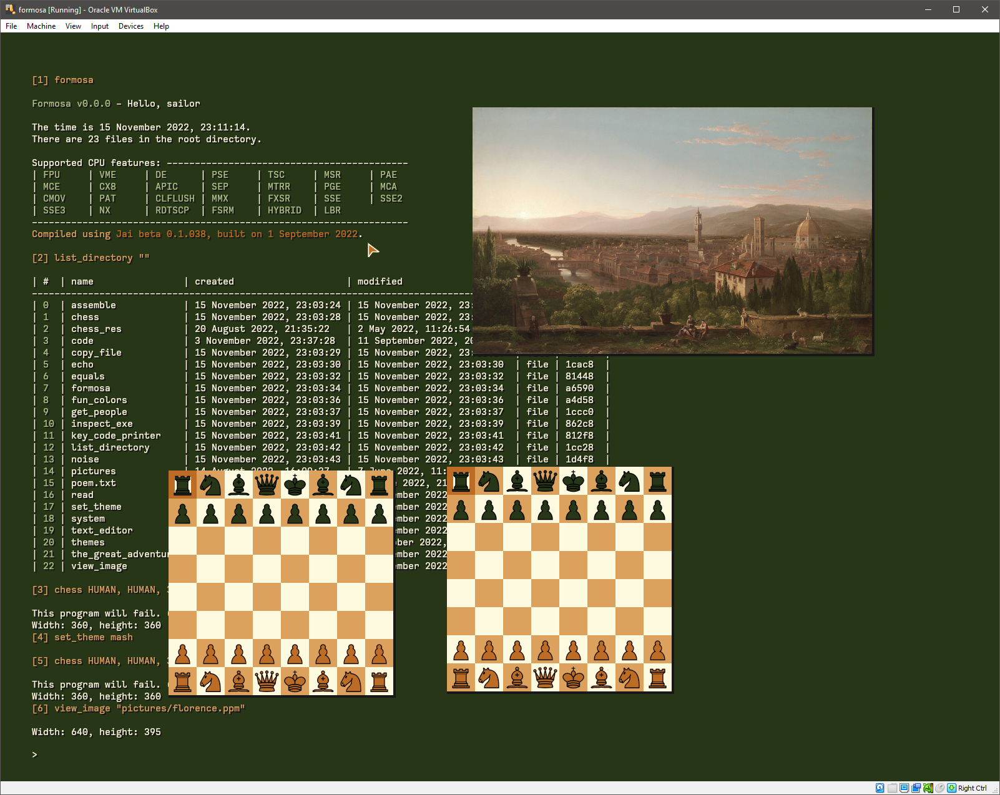

#### Current Jai version: 0.1.022

## Features
- Structured shell that can manipulate typed data
- Custom executable format that supports typechecked and autocompleteable command line parameters
- Custom filesystem with apollo-time timestamps
- Many apps like chess and text editing

## Compile and run
You have to set USE_SIMD in Basic/Print.jai to false. I do not know why. You can make a copy of Basic in theos/modules so that you don't have to modifiy the module globally.

Compile and create a floppy image for QEMU: `jai-linux first.jai -import_dir modules`  
Compile and create a VDI for virtualbox: `jai-linux first.jai -import_dir modules -- vdi`  
To run in QEMU: `qemu-system-x86_64.exe theos -cpu qemu64,+popcnt,+bmi1,+fsgsbase`

If the VM, emulator, or physical hardware that you are using reports that "No appropriate VESA mode was found", you can go into config.jai and try different resolution values. This requires that you recompile. 1024x768 is a good bet

If VirtualBox says that the disk is "inaccessible", you can try running `jai-linux first.jai -import_dir modules --vbox` as long as your vm is called "theos" and you're using a PIIX4 controller

## Screenshot

